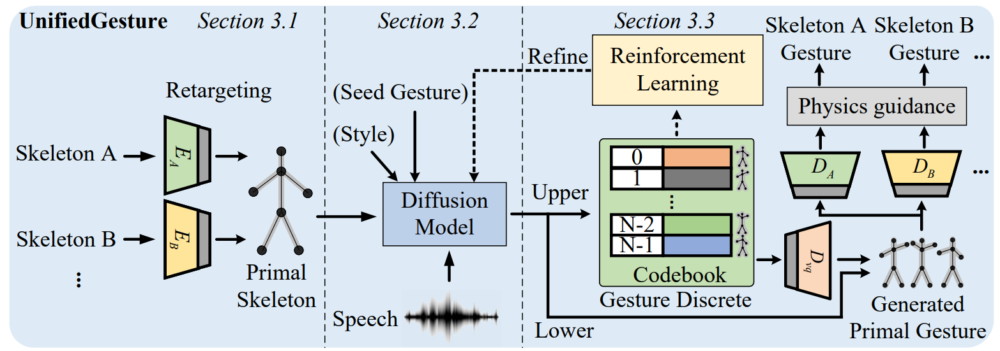

# UnifiedGesture: A Unified Gesture Synthesis Model for Multiple Skeletons

### [Arxiv](https://arxiv.org/abs/2309.07051) | [Demo](https://youtu.be/Ix22-ZRqSss) | [Presentation Video](https://youtu.be/zoWv_SJQ14o) | [Teaser Video](https://youtu.be/-iRjCvol7VM) | [Poster](acmmm23_poster.pdf)

<div center>

</div>

## 1. Getting started

Code we tested on `NVIDIA GeForce RTX 2080 Ti` (CUDA Version: 12.2).

```gitignore
conda create -n UnifiedGesture python==3.7
conda activate UnifiedGesture
pip install -r requirements.txt
```

[//]: # (netron==6.8.8)

[//]: # (nvidia-cublas-cu11==11.10.3.66)

[//]: # (nvidia-cuda-nvrtc-cu11==11.7.99)

[//]: # (nvidia-cuda-runtime-cu11==11.7.99)

[//]: # (nvidia-cudnn-cu11==8.5.0.96)

[//]: # (typeguard==3.0.2)

[//]: # (typing_extensions==4.5.0)

[//]: # (protobuf==3.20.0)

[//]: # (pycocotools)

[//]: # (en-core-web-sm aubio)

[//]: # (tensorboard-plugin-wit==1.8.1)

## 2. Quick start

Download files such as pre-trained models from [Google Drive](https://drive.google.com/drive/folders/1iU1-n3da7AXtNzotqtA8A5lYyofmAtpi?usp=sharing) or [Baidu Netdisk](https://pan.baidu.com/s/1CpoIcScmwLyfDpYUBJ-GHQ?pwd=g7g9).

Put the pre-trained models and data:

* Diffusion model
* VQVAE
* Retargeting network
* Test data (Trinity, ZEGGS)

to according folders.

Download [WavLM model](https://github.com/microsoft/unilm/tree/master/wavlm) and put it to `./diffusion_latent/wavlm_cache`

```gitignore
cd ./diffusion_latent/
python sample.py --config=./configs/all_data.yml --gpu 0 --save_dir='./result_quick_start/Trinity' --audio_path="../dataset/ZEGGS/all_speech/005_Neutral_4_x_1_0.npy" --model_path='./experiments/256_seed_6_aux_model001700000_reinforce_diffusion_onlydiff_gradnorm0.1_lr1e-7_max0_seed0/ckpt/diffusion_epoch_1.pt'
```

Optional:
* If you want to use your own audio, please directly change the path of `--audio_path` to your own audio path such as `--audio_path='../dataset/Trinity/audio/Recording_006.wav'`
* You can refer to `generate_result()` in `sample.py` to generate all the files rather than only one file.

You will get the generated motion in `./diffusion_latent/result_quick_start/Trinity/` folder with the name `xxx_recon.npy`, `xxx_code.npy` and `xxx.npy`.

Then select the target skeleton and decode the primal gesture:
```gitignore
cd ../retargeting/
python demo.py --target ZEGGS --input_file "../diffusion_latent/result_quick_start/Trinity/005_Neutral_4_x_1_0_minibatch_1080_[0, 0, 0, 0, 0, 3, 0]_123456_recon.npy" --ref_path './datasets/bvh2latent/ZEGGS/065_Speech_0_x_1_0.npy' --output_path '../result/inference/Trinity/' --cuda_device cuda:0
```
or
```gitignore
mkdir "../diffusion_latent/result_quick_start/ZEGGS/"
cp "../diffusion_latent/result_quick_start/Trinity/005_Neutral_4_x_1_0_minibatch_1080_[0, 0, 0, 0, 0, 3, 0]_123456_recon.npy" "../diffusion_latent/result_quick_start/ZEGGS/"
python demo.py --target Trinity --input_file "../diffusion_latent/result_quick_start/ZEGGS/005_Neutral_4_x_1_0_minibatch_1080_[0, 0, 0, 0, 0, 3, 0]_123456_recon.npy" --ref_path './datasets/bvh2latent/ZEGGS/065_Speech_0_x_1_0.npy' --output_path '../result/inference/Trinity/' --cuda_device cuda:0
```

And you will get `005_Neutral_4_x_1_0_minibatch_1080_[0, 0, 0, 0, 0, 3, 0]_123456_recon.bvh` in `"./result/inference/Trinity/"` folder.
You can ref [DiffuseStyleGesture](https://github.com/YoungSeng/DiffuseStyleGesture#2-quick-start) to use [Blender](https://www.blender.org/) to visualize the generated motion.
The results are shown below, try the output with different skeletons.


https://github.com/YoungSeng/UnifiedGesture/assets/37477030/a34d721a-3306-434a-9c44-de2af1701705


Finally the problem of foot sliding can be partially dealt with using inverse kinematics.

```gitignore
cd ./datasets/
python process_bvh.py --step IK --source_path "../../result/inference/Trinity/" --ref_bvh "./Mixamo_new_2/ZEGGS/067_Speech_2_x_1_0.bvh"
```

You will get `005_Neutral_4_x_1_0_minibatch_1080_[0, 0, 0, 0, 0, 3, 0]_123456_recon_fix.bvh` in the folder same as before.
The results are shown below, orange indicates the result of IK optimization performed on the lower body. And you can try to modify the threshold for foot contact speed to strike a balance between foot sliding and smoothness.


https://github.com/YoungSeng/UnifiedGesture/assets/37477030/0cc625e2-d049-465d-9aa7-c539528ea53a


## 3. Train your own model

Here we only use a small amount of data for illustration, please get all the data from [Trinity](https://trinityspeechgesture.scss.tcd.ie/) and [ZEGGS](https://github.com/ubisoft/ubisoft-laforge-ZeroEGGS).

### 3.1 Data preparation

Place the data from step 2 in the corresponding folder.

```gitignore
python process_bvh.py --step Trinity --source_path "../../dataset/Trinity/" --save_path "./Trinity_ZEGGS/Trinity/"
python process_bvh.py --step ZEGGS --source_path "../../dataset/ZEGGS/clean/" --save_path "./Trinity_ZEGGS/ZEGGS/"
python process_bvh.py --step foot_contact --source_path "./Trinity_ZEGGS/Trinity/" --save_path "./Trinity_ZEGGS/Trinity_aux/"
python process_bvh.py --step foot_contact --source_path "./Trinity_ZEGGS/ZEGGS/" --save_path "./Trinity_ZEGGS/ZEGGS_aux/"
cd ../..
python process_audio.py
```

### 3.2 Training retargeting network

Change `dataset_name = 'Mixamo_new_2'` in the `L7` of file `./retargeting/option_parser.py` to `dataset_name = 'Trinity_ZEGGS'`

```gitignore
cd ./retargeting/
python datasets/preprocess.py
python train.py --save_dir=./my_model/ --cuda_device 'cuda:0'
```

The model will be saved in: `./my_model/models/`

(Optional: change the epoch of `model.load(epoch=16000)` in line `L73` of the `./eval_single_pair.py` file to what you need.)

```gitignore
python demo.py --mode bvh2latent --save_dir ./my_model/
```

You will get latent result of the retargeting in the dataset `./datasets/Trinity_ZEGGS/bvh2upper_lower_root/`.


### 3.3 Training VQVAE model

Data preparation to generate `lmdb` files:

```gitignore
python process_root_vel.py
python ./datasets/latent_to_lmdb.py --base_path ./datasets/Trinity_ZEGGS/bvh2upper_lower_root
```

You will get the `lmdb` files in the `./retargeting/datasets/Trinity_ZEGGS/bvh2upper_lower_root/lmdb_latent_vel/` folder.

```gitignore
cd ../codebook
python train.py --config=./configs/codebook.yml --train --gpu 0
```

The trained model is saved in: `./result/my_codebook/`, Then the code for the upper body is generated.

```gitignore
python VisualizeCodebook.py --config=./configs/codebook.yml --train --gpu 0
```

### 3.4 Training diffusion model

```gitignore
cd ..
python process_code.py
python ./make_lmdb.py --base_path ./dataset/
```

You will get the `lmdb` files in the `./dataset/all_lmdb_aux/` folder.

Training the diffusion model:

```gitignore
cd ./diffusion_latent
python end2end.py --config=./configs/all_data.yml --gpu 1 --save_dir "./result/my_diffusion"
```

The trained diffusion model will be saved in: `./result/my_diffusion/`

### 3.5 RL training

TBA

### More
* If the `data.mbd` file is too small (8KB), check for issues generating the lmdb file.
* You can modify the code yourself to use [BEAT](https://github.com/PantoMatrix/BEAT), [TWH](https://github.com/facebookresearch/TalkingWithHands32M), etc. This will not be demonstrated here.

### Acknowledgments

We are grateful to 
 * [Skeleton-Aware Networks for Deep Motion Retargeting](https://github.com/DeepMotionEditing/deep-motion-editing), 
 * [MDM: Human Motion Diffusion Model](https://github.com/GuyTevet/motion-diffusion-model), 
 * [Bailando: 3D dance generation via Actor-Critic GPT with Choreographic Memory](https://github.com/lisiyao21/Bailando), and 
 * [Edge: editable dance generation from music](https://github.com/Stanford-TML/EDGE)

for making their code publicly available, which helped significantly in this work.

### Citation

If you find this work useful, please cite the paper with the following bibtex:
```
@inproceedings{yang2023UnifiedGesture,
  title={UnifiedGesture: A Unified Gesture Synthesis Model for Multiple Skeletons},
  author={Sicheng Yang, Zilin Wang, Zhiyong Wu, Minglei Li, Zhensong Zhang, Qiaochu Huang, Lei Hao, Songcen Xu, Xiaofei Wu, changpeng yang, Zonghong Dai},
  booktitle={Proceedings of the 31st ACM International Conference on Multimedia},
  year={2023},
  doi={https://doi.org/10.1145/3581783.3612503}
}
```

If you have any questions, please contact us at [yangsc21@mails.tsinghua.edu.cn](yangsc21@mails.tsinghua.edu.cn)
or [wangzl21@mails.tsinghua.edu.cn](wangzl21@mails.tsinghua.edu.cn).
